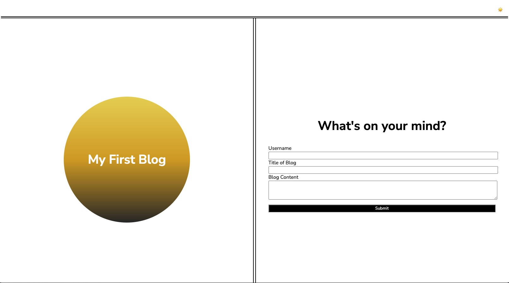

# personal_blog_project

## Description 
This app allows a user to input and view blog posts.

## Technologies
HTML, CSS, JavaScript

## Repository
https://github.com/Jlvstrasse/personal_blog_project

## Usage
Enter your username, title, and content into the appropriate fields. Click submit. That will bring you to another back where you can view your post. There is also a toggle included in the upper right hand corner that allows you to switch your screen from light mode to dark mode and vise versa

## License
MIT License

## Deployed Application
https://jlvstrasse.github.io/personal_blog_project/